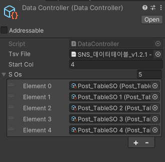
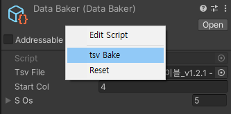

# tsv -> SO
- TSVImporter : 유니티는 tsv를 기본 지원 하지 않아 TextAsset으로 전환
- DataBaker : 가장 상위 SO로 tsv를 가공 후 행 단위로 하위 SO에 넘겨줌
  - ㄴtsv file : tsv file
  - ㄴstart line : 데이터가 시작하는 행 번호
  - ㄴScriptableObject[] : 한 행 단위로 정보를 받아와 저장
    - ㄴISetSOData : Interface 형태로 SO에 정보를 주입 하기 위해 통로
- PostTableSO : 우선 생성된 SO PostTable에 대한 정보들

- StringExtensions : SO 내에서 string -> int / string -> float 같은 형태를 빠르게 작성하기 위해 확장 함수로 작성
## 의도
- Runtime 중 데이터를 불러오기 위한 시간을 최소화 하기 위해 미리 데이터를 구운(bake) 상태로 build 하기 위해 생성 하였습니다.
- 즉, 게임 첫 불러오기 단계에서 부하 최소화

## 방식
- DataBaker가 등록된 tsv file과 SO를 참조하여, tsv의 한 행을 ISetSOData를 통해 SO에 순차적으로 주입합니다.
- 배열 형식의 문자열 하나가 열이기 때문에 (0 ~ table 열 갯수) 만큼 자동으로 주입 됩니다.

## 사용법
- 데이터를 저장할 SO 생성 및 ISetSOData 상속 및 구현
- DataBaker 생성 및 윗 줄에서 생성한 SO 등록 (밑에 1번 사진 참조)
- tsv 다운로드 및 `01Scripts/Data/DataTable/` 해당 경로 안에 tsv 추가
- DataBaker에 해당 tsv 등록
- 해당 tsv에서 실제로 시작하는 data 행 수(보통 3~4) 입력
- 인스펙터 기준 가장 위에 Open 버튼 옆 쪽 남는 공간에 우클릭 -> tsv Bake 클릭 ( 2번 사진 참조)
- Console 창에 오류 확인 및 오류 정보에 따라 수정

## 주의사항
- tsv 내부에 빈 공간이 있는 경우 다 탐색을 하기 때문에 오류가 날 수 있습니다. 항상 tsv를 뽑기 전에 빈 공간이 없는 지 확인 후 tsv로 저장합니다.
- 기본적인 예외처리가 되어 있지만, 예외 처리 되지 않은 문제가 발생 할 수 있습니다. 이런 경우 제작자에게 문의 바랍니다.