# Realtime Database 프로젝트 세팅 방법

## Firebase 프로젝트 생성
1. Firebase 접속 후 로그인 후 "콘솔로 이동" 클릭

(Firebase 링크 : https://firebase.google.com/?hl=ko)

2. "새 Firebase 프로젝트 만들기" 클릭
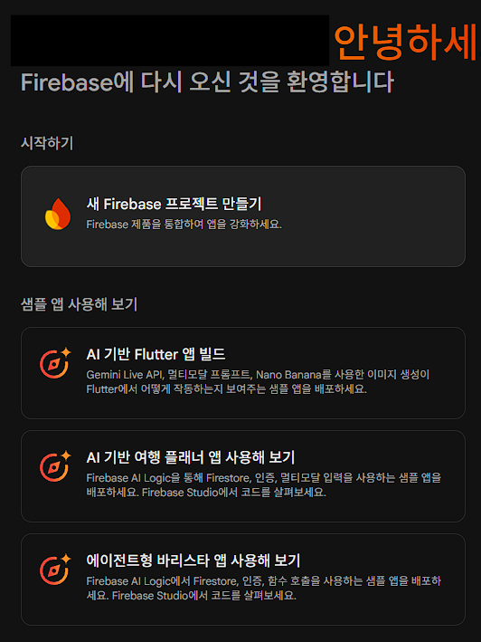

3. 프로젝트 이름 설정
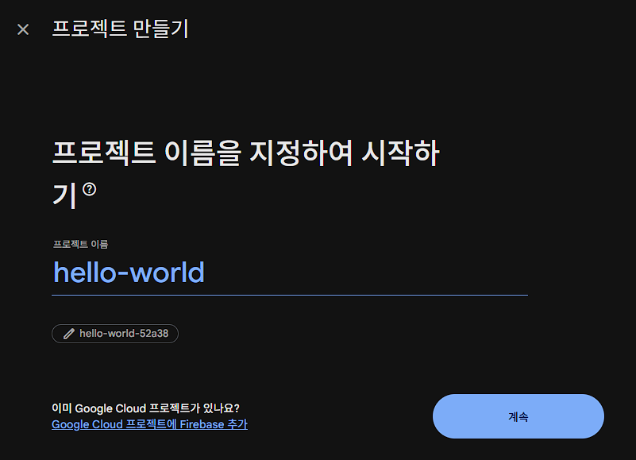

4. "Firebase의 Gemini 사용 설정" Off
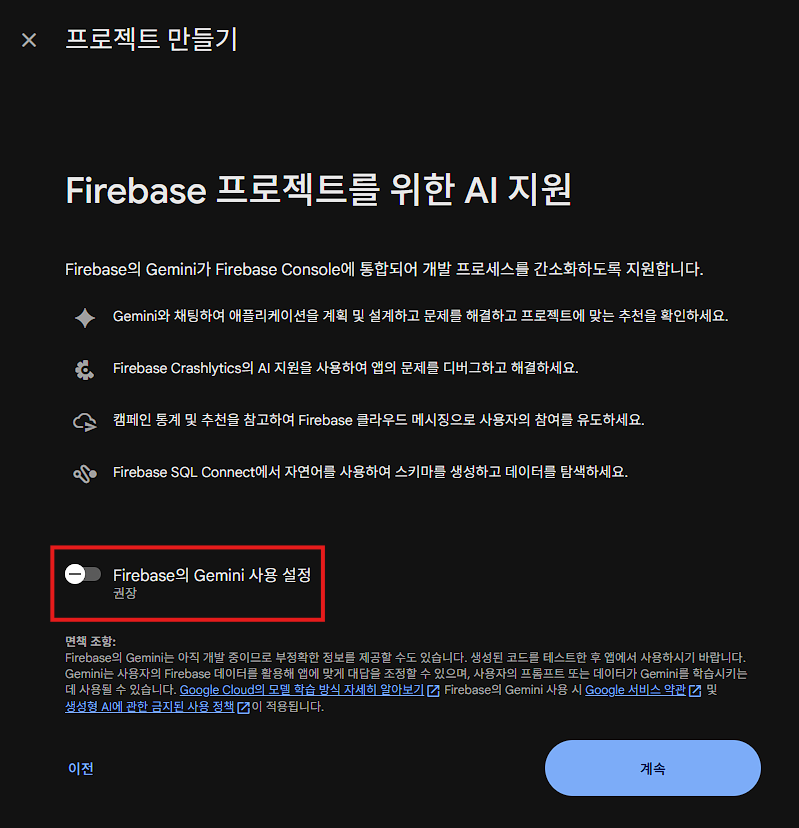

5. "이 프로젝트에서 Google 애널리틱스 사용 설정" On
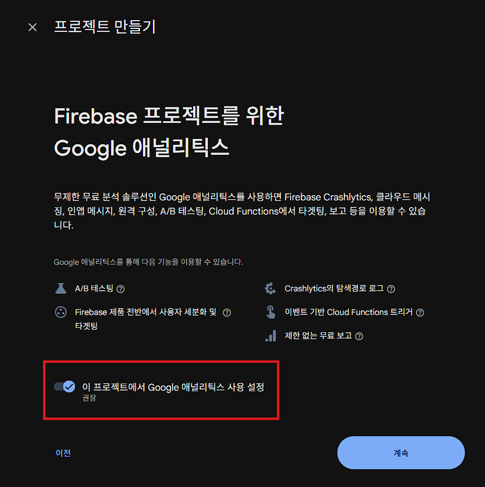

6. Google 애널리틱스 계정 선택 또는 만들기 에서 "Default Account for Firebase" 선택
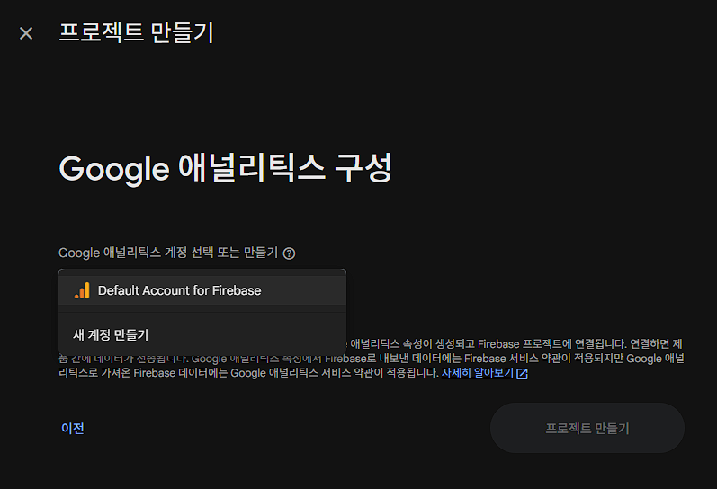

7. 로딩 후 완료시 다음과 같은 화면이 나옴
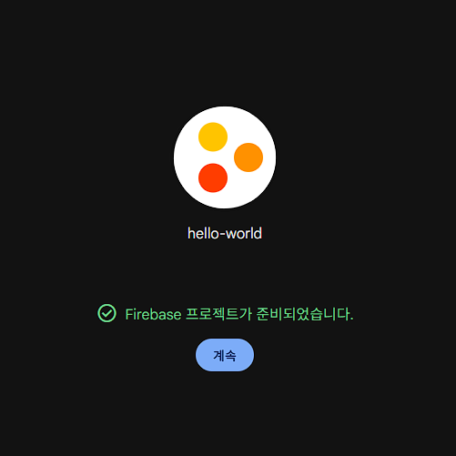

## Firebase와 Unity 연결
1. 프로젝트 개요 에서 앱 추가 클릭
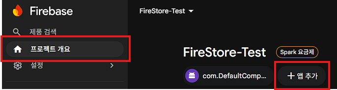

2. 유니티 선택
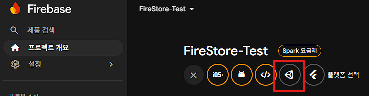

3. Android 앱으로 등록 선택후 Android 패키지 이름 기입
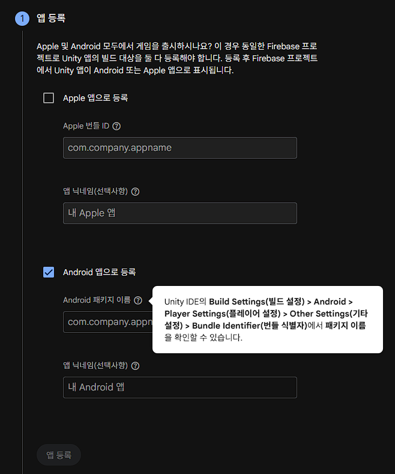
- Android 패키지 이름 위치 : Edit > Project Settings > Player > Other Settings > Mac App Store Options > Bundle Identifier 에 있음
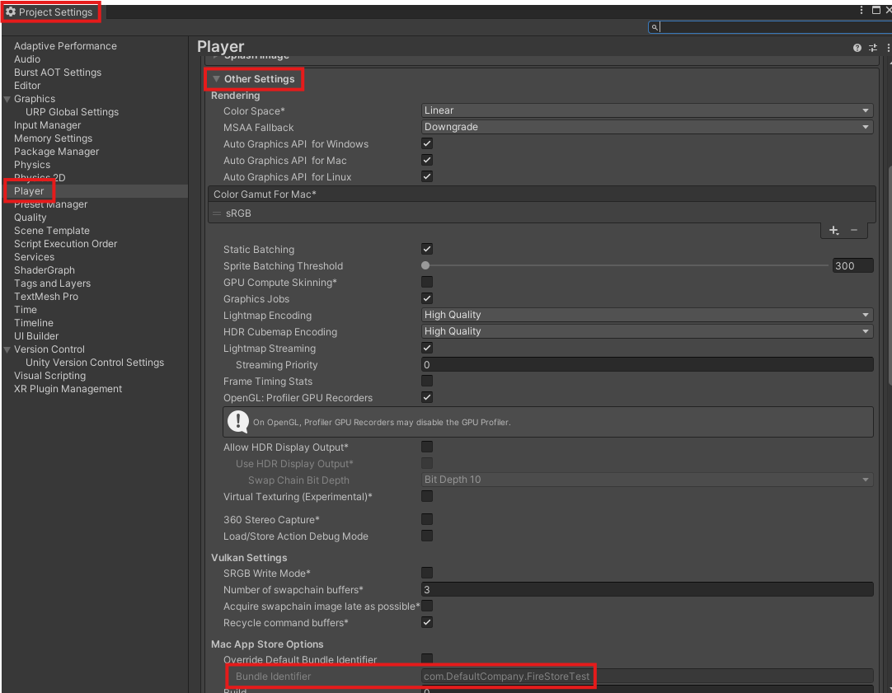

4. google-service.json 파일 다운로드 후 해당 파일을 유니티 Assets 파일에 이동, 그 후 이동한 파일을 복사하여 붙여넣은 후 그 파일의 이름을 google-services-desktop.json으로 수정
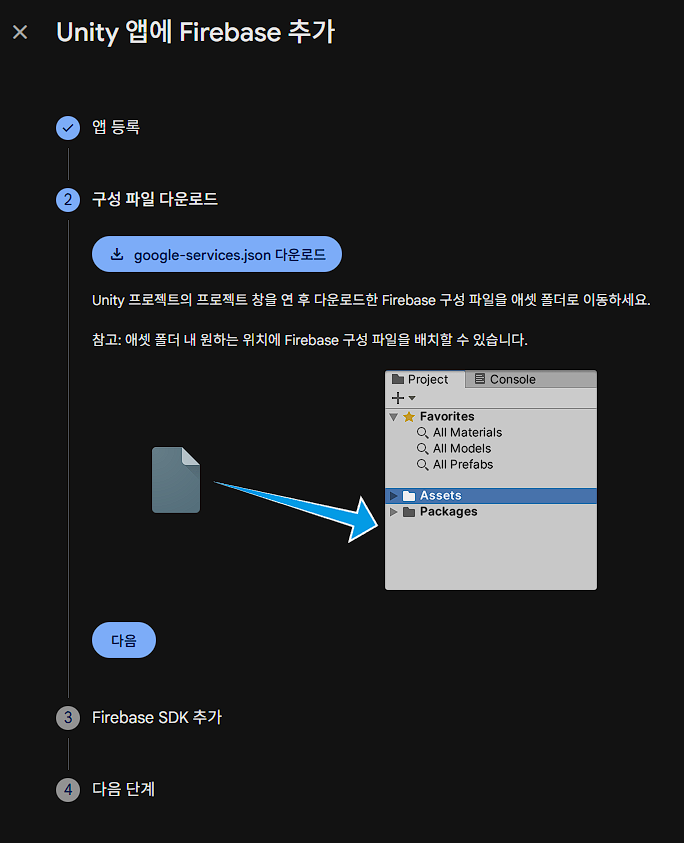
- Assets 파일 어디에 넣을지는 자유이나 원활한 유지보수를 위해 Assets 안에 파일을 새로 만들어 이동하는 것을 추천
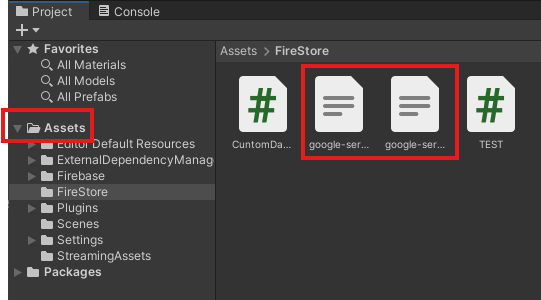

5. Firebase Unity SDK 다운로드 후 "FirebaseAnalytics", "FirebaseFirestore" 유니티 패키지 Import
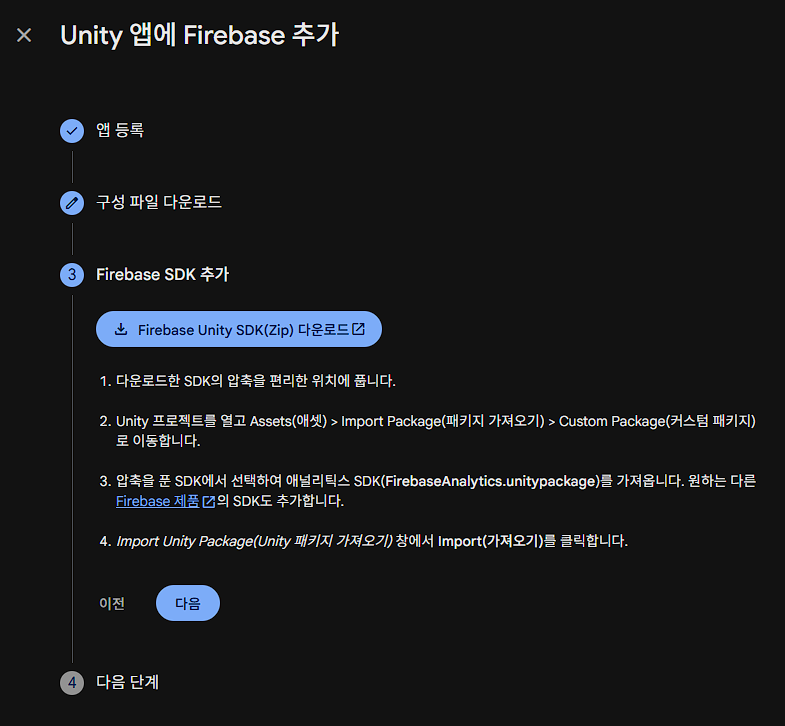
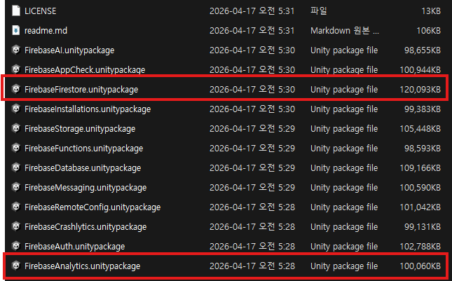

6. 정상적으로 추가되었는지 테스트
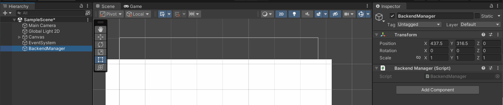
- 테스트를 위한 스크립트
```csharp
using Firebase;
using Firebase.Extensions;
using System.Collections;
using System.Collections.Generic;
using UnityEngine;

public class BackendManager : MonoBehaviour
{
    public static BackendManager Instance { get; private set; }

    private FirebaseApp app;
    public static FirebaseApp App => Instance.app;

    private void Awake()
    {
        if (Instance == null)
        {
            Instance = this;
            DontDestroyOnLoad(gameObject);
        }
        else
        {
            Destroy(gameObject);
            return;
        }

        FirebaseApp.CheckAndFixDependenciesAsync().ContinueWithOnMainThread(task => 
        {
            if (task.Result == DependencyStatus.Available)
            {
                // Create and hold a reference to your FirebaseApp,
                // where app is a Firebase.FirebaseApp property of your application class.
                app = FirebaseApp.DefaultInstance;

                // Set a flag here to indicate whether Firebase is ready to use by your app.
                Debug.Log("Firebase dependencies check success");
            }
            else
            {
                Debug.LogError($"Could not resolve all Firebase dependencies: {task.Result}");
                // Firebase Unity SDK is not safe to use here.
                app = null;
            }
        });
    }
}
```
- 정상적으로 설정 되었을 경우
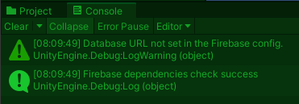

## Firebase에서 Realtime Database 생성

1. 데이터베이스 및 스토리지에서 Realtime Database 선택
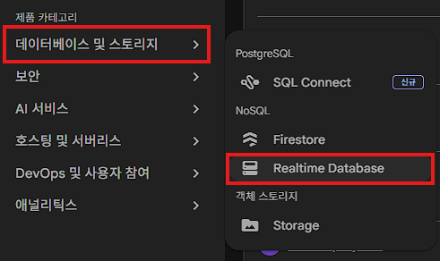

2. 데이터베이스 만들기 클릭
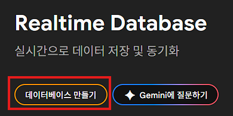

3. 실시간 데이터베이스 위치 : 싱가포르 선택
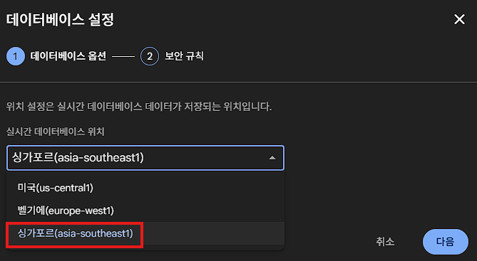

4. "테스트 모드에서 시작" 선택
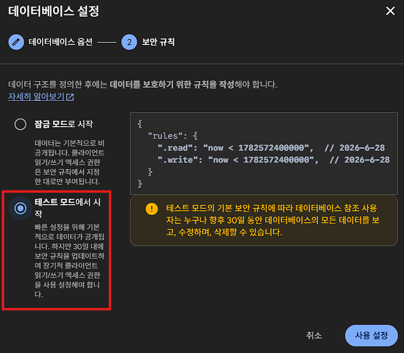

5. 생성 완료
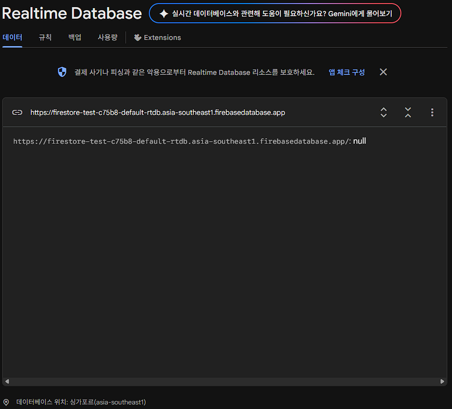

***
# Realtime Database 개요
모든 Firebase Realtime Database 데이터는 JSON 으로 저장됨, 따라서 데이터를 Read/Write 시 해당 데이터를 Json화 하는 작업이 필요함

- Read할 데이터를 불러왔을 경우
```csharp
// 데이터를 가져 온 후
DataSnapshot snapshot = task.Result;
// 가져온 데이터를 Json화
string json = snapshot.GetRawJsonValue();
```

- 데이터를 Write할 경우
```csharp
public void SaveUserData(string userId, string name, int score)
{
    User newUser = new User(name, score);
    // Write할 데이터를 Json화 
    string json = JsonUtility.ToJson(newUser);

    ...   
}
```

- Json화 된 데이터 예시 사진
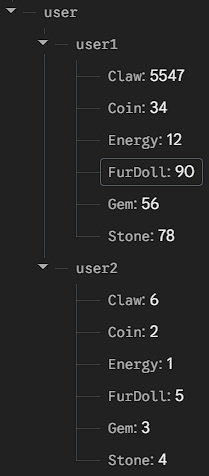

## 데이터 읽기

- GetRawJsonValue()를 통해 데이터를 한 번만 가져오는 방식
```csharp
public void LoadUserData(string userId)
{
    dbReference.Child("users").Child(userId).GetValueAsync().ContinueWith(task => {
        if (task.IsFaulted) {
            Debug.LogError("데이터 로드 실패");
        }
        else if (task.IsCompleted) {
            DataSnapshot snapshot = task.Result;
            string json = snapshot.GetRawJsonValue();
            Debug.Log($"불러온 데이터: {json}");
        }
    });
}
```

- ValueChanged 이벤트를 등록하여 데이터가 변경될 때 마다 실시간으로 콜백을 받아 변경하는 방식
```csharp
void StartListening(string userId)
{
    dbReference.Child("users").Child(userId).ValueChanged += HandleValueChanged;
}

void HandleValueChanged(object sender, ValueChangedEventArgs args)
{
    if (args.DatabaseError != null) {
        Debug.LogError(args.DatabaseError.Message);
        return;
    }
    // 데이터 변경 시 처리 로직
    Debug.Log($"실시간 데이터 업데이트: {args.Snapshot.GetRawJsonValue()}");
}
```

## 데이터 쓰기

- SetRawJsonValueAsync()를 사용 특정 경로에 데이터를 저장하거나 업데이트
```csharp
public void SaveUserData(string userId, string name, int score)
{
    User newUser = new User(name, score);
    string json = JsonUtility.ToJson(newUser);
    
    // users/userId 경로에 데이터 저장
    dbReference.Child("users").Child(userId).SetRawJsonValueAsync(json)
        .ContinueWith(task => {
            if (task.IsCompleted) Debug.Log("데이터 저장 성공");
        });
}
```

## 데이터 삭제
RemoveValueAsync()를 호출하거나, 해당 경로의 값을 null로 업데이트

### 참고 문서
- Unity에서 Firebase 프로젝트 세팅 : https://firebase.google.com/docs/unity/setup?authuser=0&hl=ko&_gl=1*1lu47c5*_up*MQ..*_ga*MTQyNjMzMDk3OS4xNzgwMDM1NDI3*_ga_CW55HF8NVT*czE3ODAwMzU0MjckbzEkZzAkdDE3ODAwMzU0MjckajYwJGwwJGgw

- Unity에서 Realtime Database 시작하기 : https://firebase.google.com/docs/database/unity/start?hl=ko&_gl=1*118are1*_up*MQ..*_ga*NDY3MDMyOTc3LjE3ODAwMzM5Njg.*_ga_CW55HF8NVT*czE3ODAwMzM5NjgkbzEkZzAkdDE3ODAwMzM5NjgkajYwJGwwJGgw
  
- 데이터 저장, 쓰기, 삭제 : https://firebase.google.com/docs/database/unity/save-data?hl=ko&_gl=1*1m96di9*_up*MQ..*_ga*NDY3MDMyOTc3LjE3ODAwMzM5Njg.*_ga_CW55HF8NVT*czE3ODAwMzM5NjgkbzEkZzAkdDE3ODAwMzM5NjgkajYwJGwwJGgw
  
- 데이터 검색 : https://firebase.google.com/docs/database/unity/retrieve-data?hl=ko&_gl=1*1m96di9*_up*MQ..*_ga*NDY3MDMyOTc3LjE3ODAwMzM5Njg.*_ga_CW55HF8NVT*czE3ODAwMzM5NjgkbzEkZzAkdDE3ODAwMzM5NjgkajYwJGwwJGgw