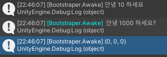

# 쉬운 디버깅을 위한 Log.Message
## 개발 목적
- Log에 호출한 Class와 Method를 호출 하기 때문에 나중에 남겨 놓은 Log를 삭제하거나, 한번에 많은 Log가 써졌을 때 쉽게 식별 가능

## 개발 방식
- Static 으로 선언 후 String builder 기반으로 최소한에 메모리 파편화를 막으면서, [CallerFilePath]와 [CallerMemberName] attribute를 사용해 class 와 class의 method를 추적
- 단순 vector3와 vector2는 지원하지 않아서 확장 method를 사용

## 사용 방식
- 추적이 필요한 위치에 Log.Message("여기에 문자열") 혹은 Log.MessageColor("여기에 문자열")로 문자 출력 - 단순 숫자 출력은 Log.Message(값)
  - 지원 범위
    - float, int, vector3, vector2, bool

```csharp

class Player()
{
    void Attack()
    {
        // 공격 로직
        Log.Message($"적에게 {40}의 피해를 줬다!")
    }

    void Att()
    {
        // 공격 로직
        Log.MessageColor($"적에게 {40}의 피해를 줬다!", Color.cyan)
    }

    void Defend()
    {
        Log.Message(10);
    }

    void Position()
    {
        Log.Message(transform.position);
    }
}

// Attack 함수 결과 : [Player.Attack] 적에게 40의 피해를 줬다!
// Att 함수 결과 : [Player.Att] 적에게 40의 피해를 줬다!
// Defend 함수 결과 : [Player.Defend] 10
// Position 함수 결과 : [Player.Position] (0,0,0)
```

- 참고 이미지


## 주의
- Debug.Log와 같은 이유로 Update, FixedUpdate 같이 매우 빠르게 자주 호출 되는 곳에서는 가급적 지양
- 버그 발생 시 작성자한테 문의